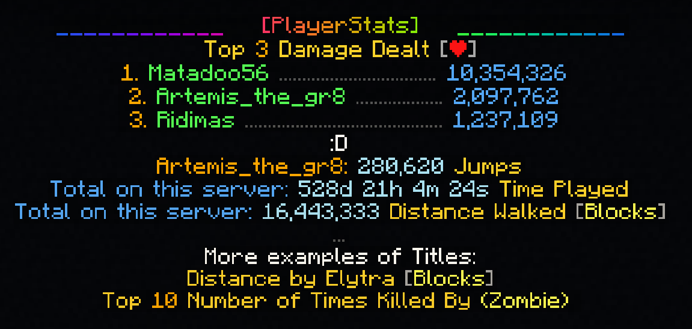

# PlayerStatsExpansion

Adds placeholders for [PlayerStats](https://www.spigotmc.org/resources/playerstats.102347/)!  

On this page, you'll find an explanation of how to use the placeholders, including some detailed [examples](#full-example).  
For FAQ, also see the [Wiki](https://github.com/Artemis-the-gr8/PlayerStatsExpansion/wiki).

&nbsp;


## Important Note about Usage

For the placeholders to work, you need a **matching PlayerStats version**! 
| Expansion | PlayerStats |
| --------- | ----------- |
|   2.0.0   | 2 or above  |
|   1.2.0   | 1.7.2       |
|   1.1.0   | 1.7         |
|   1.0.0   | 1.7         |


&nbsp;

## General Formatting Rules

* Each placeholder starts with `%playerstats_`
* The different keywords of a placeholder are separated by **commas**: 
    - `%playerstats_ x, y, z%`
* If a keyword requires an additional argument, the keyword is followed by the argument with a **colon** in between: 
    - `%playerstats_ x:1, y, z%`
* Whitespaces are allowed

&nbsp;


## Keywords

The available keywords are:
- `only: <arg>` - an optional keyword signalling that only a part of the stat-lookup should be displayed, without the other information. The options are:
    - `only:number` - get only the statistic number, with the formatting as specified in the PlaceholderAPI config
    - `only:number_raw` - get only the statistic number, stripped of any formatting and color.
    - `only:player_name` - get the name of the player that is on this position of the top-list, with the color as specified in the PlaceholderAPI config
- **selection**: 
    - `top: <n>` - get a single line from a top-statistic-list
    - `player: <player-name>` - get a player-statistic 
    - `me` - get your own statistic
    - `server` - get a server-statistic
    - `title` - get a pretty name for a statistic
        - `title: <n>` - get a pretty name for a top-n-statistic list
- **statistic**: 
    - `name: sub-name` - see [Statistic Choices](#statistic-choices) for more information

&nbsp;

**Important: a keyword for selection and statistic must always be included!**  
So, some examples of valid placeholders would be: 

```
* %playerstats_ server, animals_bred%
* %playerstats_ title: 3, cake_slices_eaten%
* %playerstats_ top: 5, deaths%
* %playerstats_ me, jump%
* %playerstats_ only:number, player: Artemis_the_gr8, mine_block: diorite%
* %playerstats_ only:player_name, player: Artemis_the_gr8, break_item: diamond_sword%
```

&nbsp;


## Placeholders

You can use placeholders to display the 3 different kinds of statistics PlayerStats offers:


### Top-x

Top-placeholders display a single line from a top-statistic. The number specified for `n`
determines which line is shown.  
In this example, you would get the player in position 2 of the most-killed-zombies-list.

```
%playerstats_ top: n, stat_name: sub_stat_name%

# Example:
%playerstats_ top: 2, kill_entity: zombie%
```


&nbsp;


### Player

The player-name needs to be from a player that has played on the server, and is not being excluded by any of PlayerStats' config settings
(for example the `exclude-banned-players` setting).  

In this example, you can see that the statistic does not have a sub-statistic, so it does not need to be filled in here.  

```
%playerstats_ player: player-name, stat_name: sub_stat_name%  

# Example:
%playerstats_ player: Artemis_the_gr8, jump%
```


&nbsp;


### Server

```
%playerstats_ server, stat_name: sub_stat_name%


# Example:
%playerstats_ server, play_one_minute%  
```


&nbsp;


### Title

On top of the statistic-placeholders, there are also placeholders to display the statistic-names in a pretty way.
To include "Top x" before the stat-name, include a number after the `title` selection.  

```
%playerstats_ title: n, stat_name: sub_stat_name%

# Example:
%playerstats_ title:3, damage_dealt%
%playerstats_title, damage_dealt%
```  

  


&nbsp;


### PlayerStats Prefix

Finally, there are some placeholders to get the PlayerStats prefix, either as a title or as a regular prefix:

```
- %playerstats_prefix%
- %playerstats_prefixtitle%
- %playerstats_rainbowprefix%
- %playerstats_rainbowprefixtitle%
```


&nbsp;


## Statistic Choices

The placeholders support all vanilla Minecraft 
[statistics](https://hub.spigotmc.org/javadocs/spigot/org/bukkit/Statistic.html).  
These statistics can be divided into two types: **general** ones, and ones that need a 
[block](https://hub.spigotmc.org/javadocs/bukkit/org/bukkit/Material.html), 
[item](https://hub.spigotmc.org/javadocs/bukkit/org/bukkit/Material.html) or 
[entity](https://hub.spigotmc.org/javadocs/bukkit/org/bukkit/entity/EntityType.html) as **sub-statistic**.
  
The stat_names and sub_stat_names are the same as they are for PlayerStats' `/stat` command, so you can always check with PlayerStats' tab-complete function to verify.

  
#### All Supported Statistics:

```
### For block, item and entity:
- mine_block: block_name
- craft_item: item_name
- use_item: item_name
- break_item: item_name
- pickup: item_name
- drop: item_name
- kill_entity: entity_name
- entity_killed_by: entity_name

### General:
- animals_bred
- armor_cleaned
- aviate_one_cm
- banner_cleaned
- beacon_interaction
- bell_ring
- boat_one_cm
- brewingstand_interaction
- cake_slices_eaten
- cauldron_filled
- cauldron_used
- chest_opened
- clean_shulker_box
- climb_one_cm
- crafting_table_interaction
- crouch_one_cm
- damage_dealt
- damage_dealt_absorbed
- damage_dealt_resisted
- damage_taken
- damage_blocked_by_shield
- damage_absorbed
- damage_resisted
- deaths
- dispenser_inspected
- drop_count
- dropper_inspected
- enderchest_opened
- fall_one_cm
- flower_potted
- fly_one_cm
- fish_caught
- furnace_interaction
- hopper_inspected
- horse_one_cm
- interact_with_anvil
- interact_with_blast_furnace
- interact_with_campfire
- interact_with_cartography_table
- interact_with_grindstone
- interact_with_lectern
- interact_with_loom
- interact_with_smithing_table
- interact_with_smoker
- interact_with_stonecutter
- item_enchanted
- jump
- leave_game
- minecart_one_cm
- mob_kills
- noteblock_played
- noteblock_tuned
- open_barrel
- pig_one_cm
- play_one_minute
- player_kills
- raid_trigger
- raid_win
- record_played
- shulker_box_opened
- sleep_in_bed
- sneak_time
- sprint_one_cm
- strider_one_cm
- swim_one_cm
- talked_to_villager
- target_hit
- time_since_death
- time_since_rest
- total_world_time
- traded_with_villager
- trapped_chest_triggered
- walk_on_water_one_cm
- walk_one_cm
- walk_under_water_one_cm
```
        
&nbsp;


## Full Example

The below picture includes the following placeholders:

```
- %playerstats_ rainbowprefixtitle%
- %playerstats_ title:3, damage_dealt%
- %playerstats_ top:1, damage_dealt%
- %playerstats_ top:2, damage_dealt%
- %playerstats_ top:3, damage_dealt%
- :D (not a placeholder)
- %playerstats_ player:Artemis_the_gr8, jump%
- %playerstats_ server, play_one_minute%
- %playerstats_ server, walk_one_cm%
- ...
- %playerstats_ title, aviate_one_cm%
- %playerstats_ title:10, entity_killed_by: zombie%
```

<p align="center">
   
</p>
